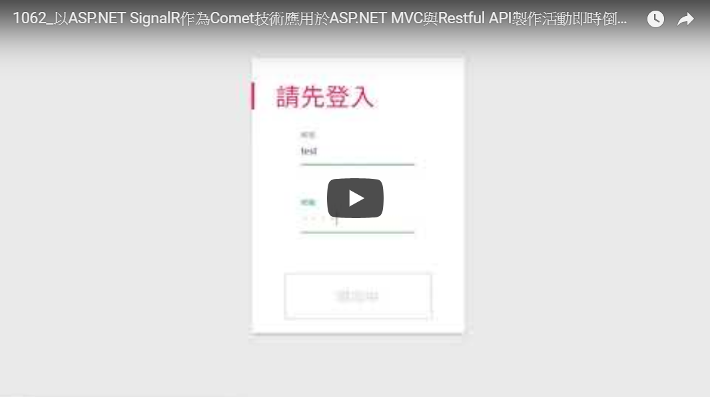

# 1062 網頁編寫與維護期末專案
## 以ASP.NET SignalR作為Comet技術應用於ASP.NET MVC與Restful API製作活動即時倒數 網頁推播系統
* 介紹：能夠即時收到活動通知訊息的網頁
* 重點檔案列表
```
  ./ActivityInstantReceiver
    ├── App_Data
    |   ├── Database.mdf 資料表檔案
    |   └── Database_log.ldf
    ├── Controllers
    |   ├── accountController.cs - 處理會員的入的Restful API
    |   ├── eventController.cs - 處理活動事件的Restful API
    |   └── serverTimeController.cs - 取得伺服器時間的Restful API
    |── Models
    |   ├── account.cs - 會員型別定義
    |   └── event.cs - 活動型別定義
    |── Scripts
    |   ├── eventMain.js - 用戶端主要處理活動js檔
    |   └── loghandler.js - 會員身分處理js檔
    ├── entrance.html - 用戶端登入頁面
    ├── eventCenter.html - 用戶端登入後之活動列表呈現
    ├── eventReceiver.cs - SignalR_用戶端活動即時接收程式
    ├── eventTimer.cs - 伺服器端時間類型活動處理程式
    ├── index.html - 用戶端網頁自動導向
    ├── manage.html - 用戶端管理員的活動管理頁面
    └── manage_account.html - 用戶端管理員的會員管理頁面
```
* Demo
[](https://youtu.be/BkQXp3QNv6c)
